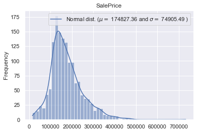
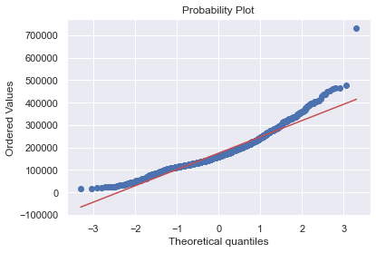

# House Price Prediction
Solution to kaggle competition "House Prices - Advanced Regression Techniques" (https://www.kaggle.com/c/house-prices-advanced-regression-techniques).

   

## Dependencies
* Python 3
* Jupyter Notebook

## How to Run
Import `HousePrices_Kaggle.ipynb` file to jupyter notebook and run.

## Solution
* Imported training dataset;
* Checked for null and duplicated data;
* Removed outliers;
* Checked data distribution;
* Normalized data using log10;
* Checked data correlation using correlation matrix;
* Selected data most likely to influence house price
* Splitted training dataset into train and test data;
* Trained multiple regression model using train data;
* Calculated determination coefficient and model error;
* Imported test dataset;
* Checked for null and duplicated data;
* Replaced null data with median;
* Removed outliers
* Checked data distribution;
* Normalized data using log10;
* Predicted house prices using test dataset;
* Created submission file;